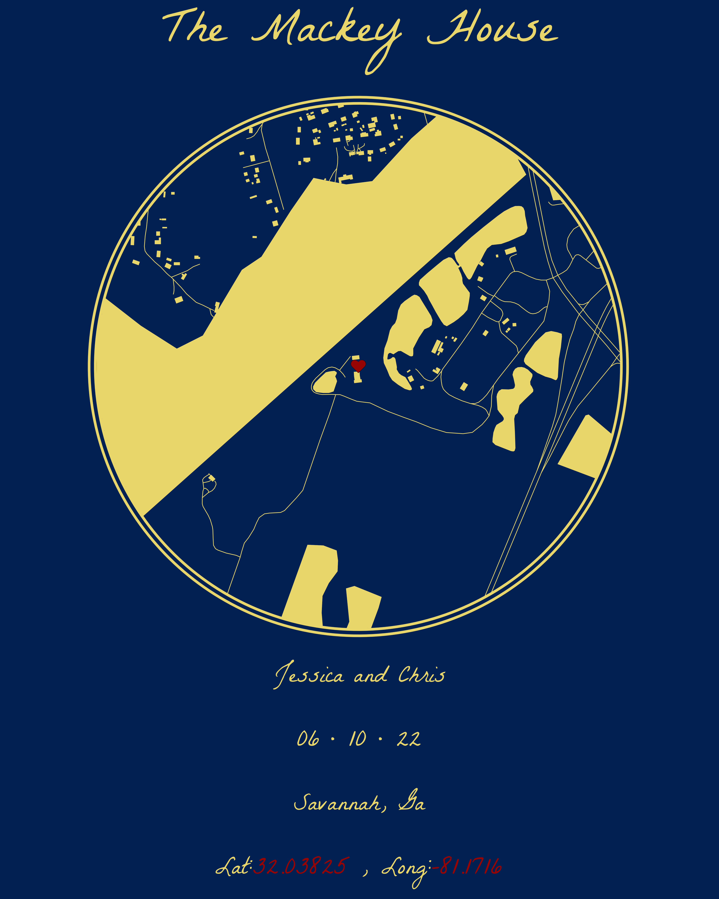

README
================

## A Wedding Gift

Script/Project files that coincide with the [*“Making Circular Maps in
ggplot”*](https://thetidytrekker.com/post/making-circular-maps/making-circular-maps.html)
blog post on [The Tidy Trekker](https://www.thetidytrekker.com).

I made a circular map cutout in ggplot and had it printed for my best
friend. The code I used to do that is [here](scripts/processing.R).

